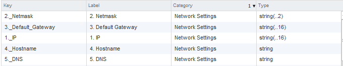
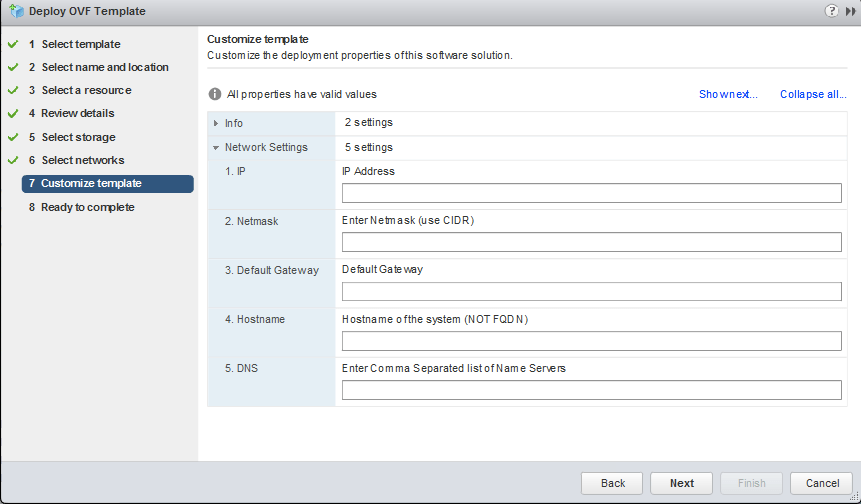

# windowsovf

If you are a Windows guy, you for sure know that there are millions of ways to deploy customised Windows OS. Some are better some are worse, and the method I will describe here today is not the best either, but it works for it’s purpose.

To summarise: We have a Windows OS with preinstalled set of Software, and we want to pack it into a template for future redistribution.

We have the following requirements:

It should be possible to provide basic network configuration details as part of OVF deployment wizard.
System should be deployed with newly generated SID, so it can be joined to an Active Directory Domain.
Sounds simple enough, but the problem for me is that I am not that familiar with Windows, especially programming anything with it. Well, I always wanted to learn some Powershell, so this was a good opportunity to start reading.

So, to get going we need several things. Here is my task list:

Obviously we will need to create a VM with Windows inside. Also at this stage we can install all the Software needed.

Next, we need to enable vApp Options on the VM and create some properties. Process is exactly the same as in my Linux OVF article. Here is what I created on mine.



With the automation we need to solve the following issues:

- Fetch vApp settings from inside the OS
- Take those settings and configure whatever is needed
- Execute Sysprep to regenerate the SID
- Lets go one by one.

## Whole Process

1. Considerations
Before we will do any development we need to do some considerations.

First thing we will need to decide is where to place our scripts. The path should be accessible by system, and Administrator user. It also need to stay in place after Sysprep is executed. I chose to place the scripts in C:\Program Files\vmenv\ .

Second thing is to create a template  XML for Sysprep unattended execution. It will be modified and applied by our script. I came up with very minimal Sysprep XML file which I will use here. I will attach it at the end for anyone who wants to reuse.

2. Fetch vApp Settings
To fetch vApp settings I will use VMware tools. Commands to do that is pretty similar to the one in Linux. I will fetch the data and write it to an XML file.

```
"C:\Program Files\VMware\VMware Tools\vmtoolsd.exe" --cmd="info-get guestinfo.ovfEnv" > "C:\Program Files\vmenv\vmenv.xml"
```

Actually I will make this line a separate getvmenv.bat script, for potential reuse by other apps in future.

3. Parse the data and assign variables
Once I have the vmenv.xml file I can fetch all the data I need from it and assign it to variables. Here is how I did it:

```
$vmenvxml = 'C:\Program Files\vmenv\vmenv.xml'
[xml]$vmenv = Get-Content $vmenvxml
    # Collect Variables from vmenv XML
    $vmIP = $vmenv.Environment.PropertySection.Property | ?{ $_.key -like '*_IP*' } | select -expand value
    $vmNetmask = $vmenv.Environment.PropertySection.Property | ?{ $_.key -like '*Netmask*' } | select -expand value
    $vmGW = $vmenv.Environment.PropertySection.Property | ?{ $_.key -like '*Gateway*' } | select -expand value
    $vmHostname = $vmenv.Environment.PropertySection.Property | ?{ $_.key -like '*Hostname*' } | select -expand value
    $vmDNS = $vmenv.Environment.PropertySection.Property | ?{ $_.key -lik
```

4. Apply Network settings
Now, we have variables with the settings we need, so we can now configure the network. First lets identify the name of Network connection we use on the system.

```
$ifname = Get-NetAdapter | Select -expand Name
```
Then, lets configure settings.

```
# Configure network interface
New-NetIPAddress –InterfaceAlias $ifname –IPAddress $vmIP –PrefixLength $vmNetmask -DefaultGateway $vmGW
# Configure DNS servers
Set-DnsClientServerAddress -InterfaceAlias $ifname -ServerAddresses $vmDNS
```

5. Configure Hostname
We will configure hostname as part of Sysprep, so what we need to do is to parse the Sysprep template XML I have created, replace hostname value and write the change to new Sysprep XML file. Here is how I did it:

```
$sysprepnofile = 'C:\Program Files\vmenv\unattend_no.xml'
$sysprepokfile = 'C:\Program Files\vmenv\unattend_ok.xml'
[xml]$vmsysprepenv = Get-Content $sysprepnofile

# Replace Hostname in Sysprep file and write it to disk
# If you have added nodes to sysprep, make sure array element number is fixed.
$vmsysprepenv.unattend.settings.Component[2].Computername = "$vmHostname"
$vmsysprepenv.Save($sysprepokfile)
```

6. Execute Sysprep
Now, once we have all we need we can execute Sysprep and let the VM reboot.

```
$sysprepexe = "C:\Windows\System32\Sysprep\sysprep.exe /generalize /oobe /reboot /unattend:'$sysprepokfile'"
Invoke-Expression -Command $sysprepexe
```

Note: This will work only in case you interface is not configured. If the interface has an IP configured, this code will fail. This is not an issue during new deployments, but keep this in mind while testing.


7. Taking care of the state
We will be scheduling this script to run on boot, and we want to make sure that it runs only once on first boot, so we need to check run state. I implemented this logic with simple state file and if statement.

$firstbootstate = 'C:\Program Files\vmenv\firstboot.state'
($vmenvstate = Get-ChildItem $firstbootstate) 2>&1 | out-null 

If ($vmenvstate.Exists) {
    # If state file exists, nothing will happen.
    Write-Output "State file exists. Nothing to do....."
}
Else {
    #Here I am executing the whole script
    <Script Contents>
    #and in the end writing to state file
    Write-Output $vmdate":FirstBoot Complete" >> $firstbootstate
}

8. Logging
Of course it makes sense to do some loging in the script.  Nothing fancy here, I just capture current date to the variable and then writing some output to log file.

```
$vmlog = 'C:\Program Files\vmenv\vmenv.log'
$vmdate = Get-Date -Format "MMddyyyy-hh:mm"
Write-Output $vmdate": SOME INFO" >> $vmlog
```

9. Scheduling
I am using standard Windows Task scheduler to schedule this script to run on boot. Here is the command I used.

```
schtasks /create /tn "VappSet" /sc onstart /delay 0000:30 /rl highest /ru system /tr "powershell.exe -file 'C:\Program Files\vmenv\vappSet.ps1'"
```


10. Cleanup and export
Once all scripts are placed and task is scheduled its time to clean up and export.

Make sure Network settings are not configured on VM, set them to use DHCP.
Configure some standard password for the Administrator user.
Remove files which are not needed.
Shutdown the VM and export it as OVF.

Outcome
As an outcome you will have a template which on import will present you with a nice wizard like this one


Based on:

The scripts in this repository are used to create Customisable Windows OVF Template for VMware vSphere. Process is described in my blog post at http://www.thevirtualist.org/creating-a-customizable-windows-ovf-template/
